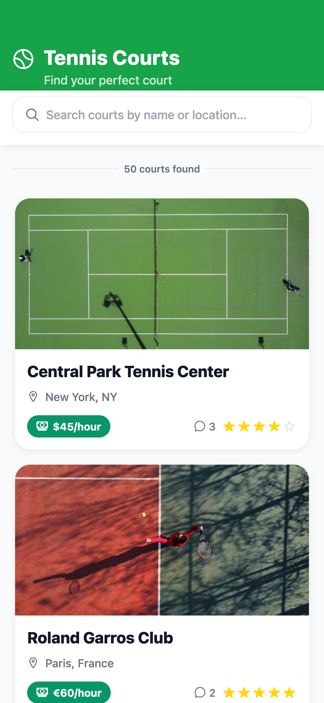
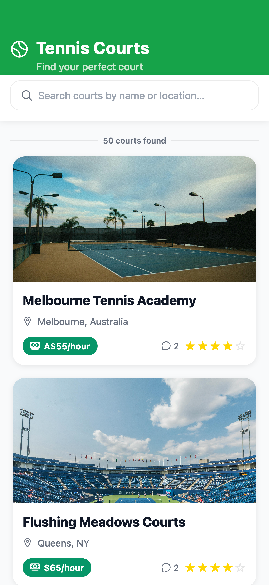
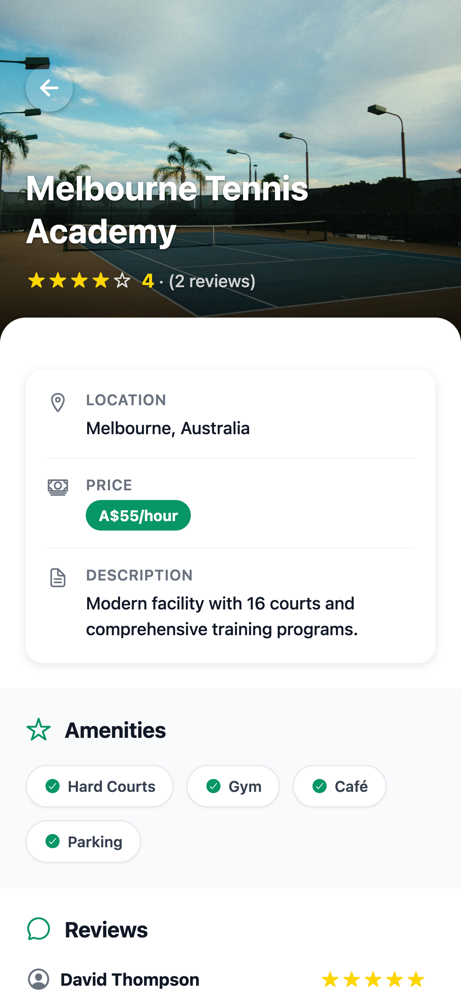
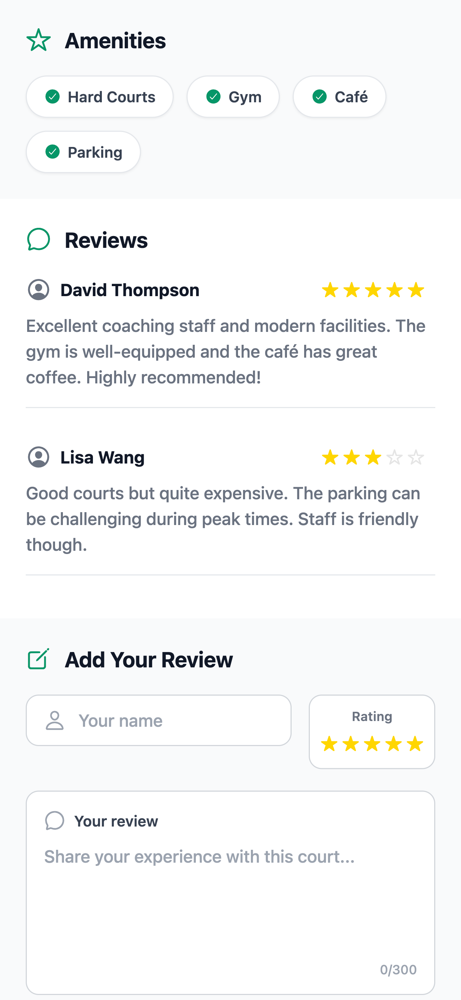

# 🎾 Tennis Court Review App

A modern, mobile-first React Native application for discovering and reviewing tennis courts. Built with Expo for cross-platform compatibility and featuring a clean, intuitive user interface.

## 📱 Overview

This application provides tennis enthusiasts with a comprehensive platform to:
- **Discover** tennis courts with detailed information
- **Search** and filter courts by name or location
- **View** detailed court information including amenities, pricing, and reviews
- **Read** authentic user reviews and ratings
- **Submit** their own reviews and ratings

## ✨ Features

### 🏆 Core Functionality
- **50+ Tennis Courts** - Comprehensive database of tennis facilities worldwide
- **Advanced Search** - Real-time search by court name or location
- **Detailed Court Information** - Complete court profiles with amenities, pricing, and descriptions
- **User Reviews System** - Read and submit reviews with 1-5 star ratings
- **Mobile-First Design** - Optimized for mobile devices with responsive layout

### 🎨 User Interface
- **Modern Design** - Clean, professional UI with consistent styling
- **Intuitive Navigation** - Seamless flow between court list and detail views
- **Visual Hierarchy** - Clear information organization with proper typography
- **Interactive Elements** - Smooth animations and responsive touch interactions
- **Accessibility** - Proper contrast ratios and touch targets

### 📊 Data Management
- **Mock Data System** - Comprehensive local data storage
- **Realistic Content** - Authentic court information and user reviews
- **Dynamic Ratings** - Automatic average rating calculation
- **Search Filtering** - Real-time search with instant results

## 🛠️ Technical Stack

- **Framework**: React Native with Expo
- **Language**: JavaScript (ES6+)
- **Navigation**: Built-in navigation system
- **Icons**: React Native Vector Icons (Ionicons)
- **Styling**: StyleSheet with mobile-first approach
- **State Management**: React Hooks (useState)
- **Data**: Local mock data with JSON structure

## 📋 Requirements Met

### ✅ Frontend Developer UI Code Challenge Requirements

#### **Courts List Page**
- ✅ **Scrollable List** - Displays 50+ tennis courts in a scrollable interface
- ✅ **Search Functionality** - Real-time search bar to filter courts by name or location
- ✅ **Mobile-Friendly Cards** - Clean card layout optimized for mobile devices
- ✅ **Court Information Display**:
  - Court name (always fully visible)
  - Location with location pin icon
  - Star rating (small, unobtrusive, bottom-right corner)
  - High-quality tennis court images
- ✅ **Visual Design**:
  - Clean, uncluttered layout
  - Proper spacing and visual balance
  - Relevant icons (rating stars, location pins, price tags)
  - Modern, professional styling

#### **Court Detail Page**
- ✅ **Comprehensive Court Information**:
  - Large, high-quality court images
  - Detailed court descriptions
  - Location information
  - Star ratings with review counts
  - Pricing information
- ✅ **User Reviews System**:
  - Display existing reviews with ratings and comments
  - User-friendly review submission form
  - Name and rating input fields
  - Comment textarea with character counter
  - Form validation and submission handling
- ✅ **Modern UI Design**:
  - Clean, modern interface
  - Clear information hierarchy
  - Proper spacing and typography
  - Delightful interactions and animations

#### **Data Requirements**
- ✅ **50+ Mock Courts** - Comprehensive database of tennis facilities
- ✅ **Complete Court Objects** - Each court includes:
  - `id` - Unique identifier
  - `name` - Court name
  - `location` - Geographic location
  - `rating` - Whole number rating (1-5)
  - `image` - High-quality tennis court image URL
  - `reviews` - Array of user reviews
  - `description` - Detailed court description
  - `amenities` - Available facilities and services
  - `price` - Hourly pricing information
- ✅ **Realistic Reviews** - Each court includes 2-3 sample reviews with:
  - Unique review IDs
  - User names
  - Star ratings (1-5)
  - Detailed comments
  - Timestamps

#### **Design & Code Quality**
- ✅ **Mobile-First Design** - Optimized for mobile devices
- ✅ **Elegant UI** - Intuitive and delightful user experience
- ✅ **Clean Code** - Readable, efficient, and well-organized
- ✅ **JavaScript/TypeScript** - Pure JavaScript implementation
- ✅ **Scalability** - Modular code structure for easy maintenance

## 🚀 Getting Started

### Prerequisites
- Node.js (v14 or higher)
- npm or yarn
- Expo CLI (`npm install -g @expo/cli`)

### Installation

1. **Clone the repository**
   ```bash
   git clone <repository-url>
   cd coding_challenge
   ```

2. **Install dependencies**
   ```bash
   npm install
   ```

3. **Start the development server**
   ```bash
   npm start
   # or
   npx expo start
   ```

4. **Run on your preferred platform**
   ```bash
   # Web
   npm run web
   
   # iOS Simulator
   npm run ios
   
   # Android Emulator
   npm run android
   ```

### Development Commands

```bash
# Start development server
npm start

# Run on web
npm run web

# Run on iOS
npm run ios

# Run on Android
npm run android

# Clear cache and restart
npx expo start --clear
```

## 📁 Project Structure

```
coding_challenge/
├── App.js                 # Main application component
├── index.js              # Entry point
├── package.json          # Dependencies and scripts
├── app.json             # Expo configuration
├── .gitignore           # Git ignore rules
├── README.md            # Project documentation
├── prompts.txt          # Development history and prompts
├── assets/              # Static assets
│   └── images/          # Image assets
├── screenshots/         # App screenshots and documentation
│   └── README.md        # Screenshot organization guide
└── src/
    └── data/
        └── mockData.js  # Mock tennis court data
```

## 🎯 Key Features Implementation

### Search Functionality
- **Real-time Search**: Instant filtering as user types
- **Multi-field Search**: Searches both court names and locations
- **Clear Button**: Easy search reset functionality
- **Results Counter**: Shows number of matching courts

### Court Cards
- **Responsive Design**: Adapts to different screen sizes
- **Visual Hierarchy**: Clear information organization
- **Interactive Elements**: Touch-friendly buttons and links
- **Image Optimization**: High-quality tennis court images

### Review System
- **User Input**: Name, rating, and comment fields
- **Validation**: Form validation with error handling
- **Character Counter**: Real-time character count for comments
- **Rating Display**: Visual star rating system

### Navigation
- **Smooth Transitions**: Seamless navigation between screens
- **Back Navigation**: Intuitive back button functionality
- **State Management**: Proper state handling for selected courts

## 🎨 Design System

### Color Palette
- **Primary Green**: `#16a34a` - Main brand color
- **Success Green**: `#16a34a` - Success states and pricing
- **Text Primary**: `#111827` - Main text color
- **Text Secondary**: `#6B7280` - Secondary text color
- **Background**: `#FFFFFF` - Clean white background
- **Border**: `rgba(0, 0, 0, 0.08)` - Subtle borders

### Typography
- **Headings**: 24-28px, font-weight 800
- **Subheadings**: 18-20px, font-weight 600
- **Body Text**: 14-16px, font-weight 400
- **Small Text**: 12-14px, font-weight 400

### Spacing
- **Base Unit**: 8px grid system
- **Card Padding**: 16px
- **Section Spacing**: 12-16px
- **Element Spacing**: 8px

## 📱 Screenshots

### Courts List Page

*Clean header with search functionality and scrollable court cards*

### Court Detail Page - Main View

*Large court image with gradient overlay, back navigation, and comprehensive court information*

### Court Detail Page - Reviews Section

*User reviews with star ratings, detailed comments, and review submission form*

### Court Detail Page - Add Review Form

*Interactive review form with name input, star rating, comment textarea, and submit button*

### Design Features Showcased
- **Modern UI**: Clean, professional interface with consistent styling
- **Visual Hierarchy**: Clear information organization and typography
- **Interactive Elements**: Smooth animations and responsive touch interactions
- **Accessibility**: Proper contrast ratios and touch-friendly targets

### Key Visual Elements
- 🎾 **Tennis Court Images**: High-quality, contextually relevant photos
- ⭐ **Star Ratings**: Visual rating system with gold stars
- 🏷️ **Price Chips**: Green pill-shaped pricing indicators
- 🔍 **Search Interface**: Clean search bar with focus states
- 📱 **Mobile-First**: Responsive design for all screen sizes

## 🔧 Configuration

### Expo Configuration (`app.json`)
```json
{
  "expo": {
    "name": "Tennis Court Review App",
    "slug": "tennis-court-reviewer",
    "version": "1.0.0",
    "platforms": ["ios", "android", "web"],
    "orientation": "portrait",
    "icon": "./assets/icon.png",
    "splash": {
      "image": "./assets/splash.png",
      "resizeMode": "contain",
      "backgroundColor": "#ffffff"
    }
  }
}
```

## 📊 Data Structure

### Court Object
```javascript
{
  id: number,
  name: string,
  location: string,
  rating: number,
  image: string,
  reviews: Review[],
  description: string,
  amenities: string[],
  price: string
}
```

### Review Object
```javascript
{
  id: number,
  name: string,
  rating: number,
  comment: string,
  createdAt: string
}
```

## 🚀 Deployment

### Web Deployment
The app can be deployed to web platforms using Expo's web build:
```bash
npx expo build:web
```

### Mobile Deployment
For mobile deployment, use Expo's build service:
```bash
# iOS
npx expo build:ios

# Android
npx expo build:android
```

## 📸 Adding Screenshots

To add screenshots to the project:

1. **Run the app** using `npm start` or `npm run web`
2. **Take screenshots** of key features and screens
3. **Save images** in the `/screenshots` folder with descriptive names:
   - `courts-list-main.png` - Main courts list view
   - `court-detail-main.png` - Court detail page
   - `mobile-views.png` - Mobile responsive design
4. **Update documentation** in `/screenshots/README.md`
5. **Remove placeholder** files once real screenshots are added

### Screenshot Guidelines
- Use high resolution (1080p minimum)
- Capture key features and interactions
- Show both desktop and mobile views
- Maintain consistent naming convention
- Ensure good lighting and contrast

## 📝 Development History

The complete development process, including all prompts, requirements, and iterations, is documented in the `prompts.txt` file. This file contains:
- Initial project setup and requirements
- UI/UX design iterations
- Feature implementations
- Bug fixes and optimizations
- Final refinements and polish

## 🤝 Contributing

1. Fork the repository
2. Create a feature branch (`git checkout -b feature/amazing-feature`)
3. Commit your changes (`git commit -m 'Add some amazing feature'`)
4. Push to the branch (`git push origin feature/amazing-feature`)
5. Open a Pull Request

## 📄 License

This project is licensed under the MIT License - see the [LICENSE](LICENSE) file for details.

## 👨‍💻 Author

**Pranav Zagade**
- Frontend Developer
- React Native & Expo Specialist
- Mobile-First Design Advocate

## 🙏 Acknowledgments

- Expo team for the excellent development platform
- React Native community for continuous support
- Pexels for high-quality tennis court images
- All beta testers and contributors

---

**Built with ❤️ using React Native and Expo**