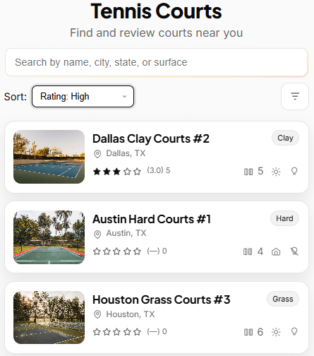

# Tennis Courts App

A modern, mobile-first React application for discovering and reviewing tennis courts. Built with a clean, minimal design featuring an animated aurora search bar and comprehensive court filtering.




## Features

- **Court Discovery**: Browse 60+ tennis courts with detailed information
- **Smart Search**: Search by name, city, state, or surface type with animated aurora border
- **Advanced Filtering**: Filter courts by surface, indoor/outdoor, lights, and minimum court count
- **Flexible Sorting**: Sort by name (A-Z), rating (high/low), or court count
- **Court Reviews**: Leave and read reviews with 5-star rating system
- **Mobile-First Design**: Fully responsive with fluid scaling across all devices
- **Modern UI**: Clean white theme with subtle animations and hover effects

## Tech Stack

- **React** - Component-based architecture
- **CSS3** - Modern styling with CSS Grid, Flexbox, and custom properties
- **Local Storage** - Persistent review data
- **Hash-based Routing** - Simple navigation between list and detail views
- **SVG Icons** - Scalable icons for court features
- **Google Fonts** - Inter and Plus Jakarta Sans typography

## Getting Started

1. Clone this repository
2. Install dependencies: `npm install`
3. Checkout branch: `git checkout feat/tennis-courts-ui-rohan`
4. Start the development server: `npm start`
5. Open [http://localhost:3000](http://localhost:3000) to view the app

## Reviewer Notes
- Designed for **mobile-first experience** (please test in Chrome DevTools mobile view).  
- Reviews persist in **localStorage** across refresh.  
- Mock dataset includes 60+ courts for scalability testing.  
- With more time, I would add pagination/infinite scroll and photo carousel for court images.

## Project Structure

```
src/
├── courts/
│   ├── CourtsApp.js      # Main app component with routing
│   ├── CourtsList.js     # Court listing with search/filter/sort
│   ├── CourtDetail.js    # Individual court details and reviews
│   ├── mockCourts.js     # Mock court data (60+ courts)
│   ├── storage.js        # Local storage helpers for reviews
│   └── courts.css        # Responsive styling and animations
├── components/
│   └── ShineBorder.js    # Animated aurora border component
└── index.js              # App entry point
```

## Key Components

- **CourtsList**: Displays court cards with search, filtering, and sorting
- **CourtDetail**: Shows court information, image, and review system
- **ShineBorder**: Animated gradient border for the search bar
- **Icon**: SVG icon component for court features (lights, indoor/outdoor, etc.)
- **Star**: Interactive star rating component with hover animations

## Design Highlights

- **Responsive Cards**: Single-column layout with image and details
- **Modern Dropdowns**: Clean styling with custom chevron arrows
- **Smooth Interactions**: Hover effects and transitions throughout
- **Accessibility**: ARIA labels and keyboard navigation support

## Development Notes

- Built without external routing libraries (hash-based navigation)
- Mock data approach for demonstration purposes
- Mobile-first responsive design using CSS clamp() and viewport units
- Clean separation of concerns with dedicated CSS and component files

## Reviewer Notes
- Designed for **mobile-first experience** (please test in Chrome DevTools mobile view).  
- Reviews persist in **localStorage** across refresh.  
- Mock dataset includes 60+ courts for scalability testing.  
- With more time, I would add pagination/infinite scroll and photo carousel for court images.
