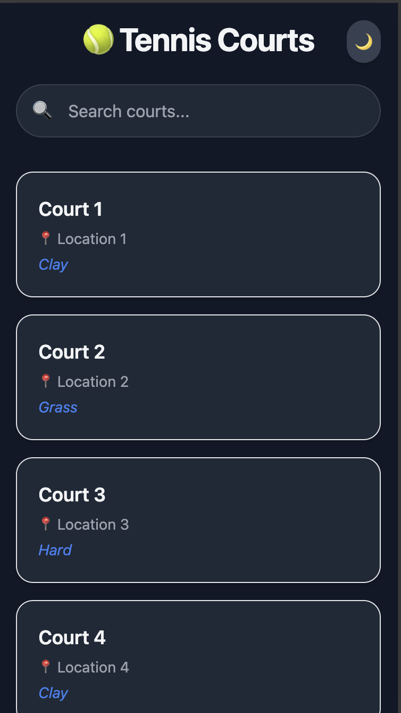
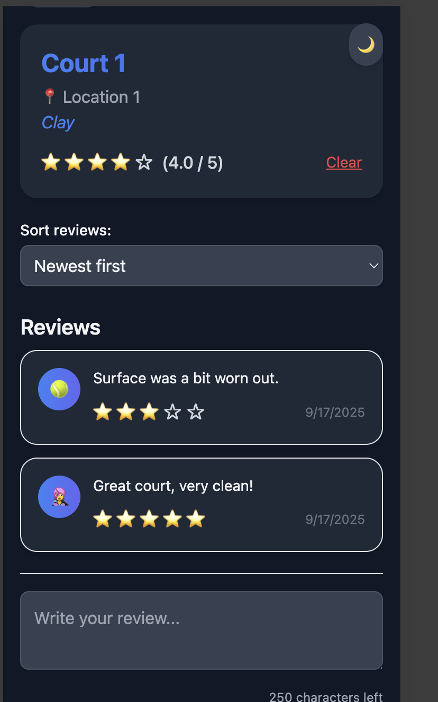
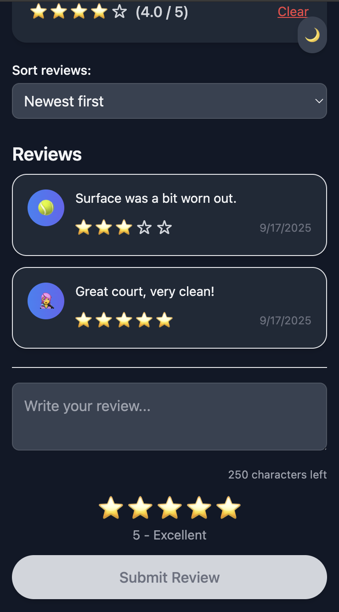

# 🎾 Tennis Courts Review App

A **mobile-first two-page web app** for browsing, searching, and reviewing tennis courts.  
Built for the frontend challenge assignment. Designed to be **delightful, scalable, and accessible**.

---

## 🚀 Features

### Core
- **Splash screen** with animation and dark mode support.
- **Courts list page**:
  - 60+ mocked courts.
  - Sticky search bar.
  - Mobile-first responsive design.
  - Skeleton loaders when no data.
- **Court detail page**:
  - Court info card with gradient design.
  - Reviews with average rating.
  - Add a new review with:
    - Star rating system (click or keyboard accessible).
    - Character counter + warning threshold.
    - Emoji avatars for reviewers.
  - Sort reviews (newest, highest, lowest).
  - Animated toast notifications for actions.
  - Skeleton shimmer loading while adding.

### Delightful Details
- **Dark mode toggle** 🌙 / ☀️ (persistent via `localStorage`).
- **Animated shimmer skeletons** for review loading.
- **Gradient cards** for courts and reviews.
- **Micro-interactions**:
  - Hover scale effects.
  - Animated stars when selected.
  - Smooth toast fade-out.
- **Accessibility**:
  - Aria labels for buttons and stars.
  - Toasts announced with `aria-live`.

---

## 📱 Screenshots / Demo

> _(Add screenshots or GIFs here once you run the app)_  

### Courts List Page

### Court Detail Page

### Dark Mode

---

## 🛠️ Tech Stack

- **React + Vite**
- **React Router** (two pages)
- **TailwindCSS** (styling + dark mode)
- **LocalStorage** (dark mode persistence)
- **Mocked Data** (60 courts, in `/data/courts.js`)

---

## 📂 Project Structure
src/
├── components/
│ ├── DarkModeToggle.jsx
│ ├── SplashScreen.jsx
│ ├── Toast.jsx
│ ├── ToastContainer.jsx
│ └── ReviewSkeleton.jsx
├── data/
│ └── courts.js
├── pages/
│ ├── CourtsPage.jsx
│ └── CourtDetailPage.jsx
├── App.jsx
├── main.jsx
└── index.css